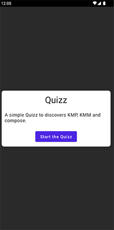
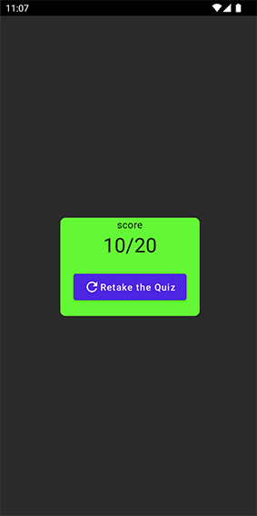

# User interface (30 min)

## Definitions

### [Kotlin Compose Multiplatform](https://www.jetbrains.com/lp/compose-mpp/)

Compose Multiplatform simplifies and accelerates UI development for Desktop and Web applications, and allows extensive UI code sharing between Android, iOS, Desktop and Web.
It's a modern toolkit for building native UI. Quickly bring your app to life with less code, powerful tools, and intuitive Kotlin APIs.
It is based on [Android Jetpack Compose](https://developer.android.com/jetpack/compose) declarative UI approach ( which is similar also to [SwiftUI](https://developer.apple.com/xcode/swiftui/) for iOS )

### [UIKit](https://developer.apple.com/documentation/uikit)

UIKit provides a variety of features for building apps, including components you can use to construct the core infrastructure of your iOS, iPadOS, or tvOS apps. The framework provides the window and view architecture for implementing your UI, the event-handling infrastructure for delivering Multi-Touch and other types of input to your app, and the main run loop for managing interactions between the user, the system, and your app.

## Activate compose multiplatform

### Update the library project (shared)

#### Add compose library support for all platforms

build.gradle.kts (global)
```groovy
...
    id("org.jetbrains.compose").version("1.3.1").apply(false)
...
```

::: warning
for iOS experimental compatibility, some gradle environment variables need to be set in ``gradle.properties``

```bash
org.jetbrains.compose.experimental.uikit.enabled=true
kotlin.native.cacheKind=none
```
:::

build.gradle.kts (shared)
```groovy
plugins {
    id("org.jetbrains.compose")
    kotlin("native.cocoapods")

    ...
            isStatic = true // Mandatory : on cocoapods config define your lib as static 
    ...
  sourceSets {
    val commonMain by getting {
            dependencies {
                implementation(compose.ui)
                implementation(compose.foundation)
                implementation(compose.material)
                implementation(compose.runtime)
    
    ...

    val desktopMain by getting {
            dependencies {
                api(compose.preview)
    
    ...

   dependencies {
        implementation("androidx.compose.ui:ui-tooling-preview:1.4.0")
        debugImplementation("androidx.compose.ui:ui-tooling:1.4.0")
   }

```

#### Create a new App.kt file in `commonMain` source files

This file will contain the first composable view for all platforms.

```kotlin
package com.devoxxfr2023.km

import androidx.compose.material.MaterialTheme
import androidx.compose.runtime.Composable
import androidx.compose.material.Text

@Composable
internal fun App() {
    MaterialTheme {
         Text("Hello world")
    }
}
```

### Activate for Android

#### Check your compose dependencies on the Android project 

build.gradle.kts (androidApp)
```groovy
...
    implementation("androidx.compose.ui:ui:1.3.1")
    implementation("androidx.compose.ui:ui-tooling:1.3.1")
    implementation("androidx.compose.ui:ui-tooling-preview:1.3.1")
    implementation("androidx.compose.foundation:foundation:1.3.1")
    implementation("androidx.compose.material:material:1.3.1")
    implementation("androidx.activity:activity-compose:1.6.1")
```


#### Share the App() composable on the Android library source (androidMain)

* create a new kotlin file ``AndroidApp.kt``

```kotlin
package com.devoxxfr2023.km

import androidx.compose.runtime.Composable

@Composable
fun AndroidApp() {
    App()
}
```

#### Use this composable on your app Activity (androidApp)

```kotlin
package com.devoxxfr2023.km.android

import android.os.Bundle
import androidx.activity.ComponentActivity
import androidx.activity.compose.setContent
import com.devoxxfr2023.km.AndroidApp

class MainActivity : ComponentActivity() {
    override fun onCreate(savedInstanceState: Bundle?) {
        super.onCreate(savedInstanceState)
        setContent {
            AndroidApp()
            }
        }
    }
```

* You can now simply play your Android run configuration.


### Activate for Desktop

#### Update your gradle configuration

 *build.gradle.kts (desktopApp)*
 ```groovy
import org.jetbrains.compose.desktop.application.dsl.TargetFormat

plugins {
    kotlin("multiplatform")
    id("org.jetbrains.compose") //plugin compose 
    // NB: remove application dependency
...
    sourceSets {
            val jvmMain by getting {
                dependencies {
                    implementation(project(":shared"))
                    implementation(compose.desktop.currentOs) //compose dependency
                }
            }
        }
...
    compose.desktop { // the block replace 
        application { // application previous declaration for gradle task "run"
            mainClass = "MainKt"
            nativeDistributions {
                targetFormats(TargetFormat.Dmg, TargetFormat.Msi, TargetFormat.Deb)
                packageName = "desktop"
                packageVersion = "1.0.0"
            }
        }
    }
```

#### Share the App() composable on the Desktop library source (desktopMain)

```kotlin
package com.devoxxfr2023.km

import androidx.compose.runtime.Composable

@Composable
fun DesktopApp() {
    App()
}
```

#### Use this composable on your app  (desktopApp)

```kotlin
import androidx.compose.ui.window.Window
import androidx.compose.ui.window.application
import com.devoxxfr2023.km.DesktopApp

fun main() = application { // kotlin application
    Window(onCloseRequest = ::exitApplication, title = "QuizzApp") {
        DesktopApp() // composable view shared
    }
}
```

### Activate for iOS (experimental)

#### Share the App() composable on the iOS library source (iosMain)

* Create a new kotlin file named ``IosApp.kt``

```kotlin
package com.devoxxfr2023.km

import androidx.compose.ui.window.ComposeUIViewController
import platform.UIKit.UIViewController

fun MainViewController(): UIViewController =
    ComposeUIViewController {
        App()
    }
```

#### Use this composable on your xcode app by replacing iOSApp.swift code  (iosApp)

iosApp/iosApp/iOSApp.swift
```swift
import SwiftUI
import shared

@UIApplicationMain
class AppDelegate: UIResponder, UIApplicationDelegate {
    var window: UIWindow?

    func application(_ application: UIApplication, didFinishLaunchingWithOptions launchOptions: [UIApplication.LaunchOptionsKey: Any]?) -> Bool {
        window = UIWindow(frame: UIScreen.main.bounds)
        let mainViewController = IosAppKt.MainViewController()
        window?.rootViewController = mainViewController
        window?.makeKeyAndVisible()
        return true
    }
}
```

## How to create composables ?

Composables are UI components that can be simply declared with code as functions, properties (such as text color, fonts...) as function parameters and subviews are declared on function declaration.

* An `@Composable` annotation come always before the composable function. 
* Properties of size, behaviors of components can be set thanks to `Modifiers`
* You can align components with containers composables such as `Column` (Vertically), `Box`, `Row` (Horizontally)
* Also you can preview composables with the annotation `@Preview` before the composable annotation.

Example: 2 text vertically aligned that fit all the width of the screen.

```kotlin
@Composable
internal fun App() {
    MaterialTheme {
        Column(Modifier.fillMaxWidth()) {
            Text( "My Text1", color = Color.Blue)
            Text(text = "My Text2")
        }
    }
}
```

::: tip
For more information, you can have a look to [Android Jetpack Compose documentation]('https://developer.android.com/jetpack/compose/layouts/material')
:::

## Create composable views for the Quiz


### WelcomeScreen



You can now create your first view.
For the Quiz we need a welcome screen displaying a Card centered with a button inside to start the quiz
It is simply compose of the following composables :
* a Card  rounded shape container
* a Text 
* a Button

* Create a new composable `WelcomeScreen.kt` on commonMain module 
* Make sure that the App() composable is using it has below 

```kotlin
@Composable
internal fun App() {
    MaterialTheme {
        welcomeScreen()
    }
}
```

* Run you first view on all platforms , it should work. 

::: tip
You can see a proposal of answer [here]("../assets/sources/WelcomeScreen.kt")
:::

### ScoreScreen



The second view will be quite similar but able de show final scores


* Create a new composable `ScoreScreen.kt` on commonMain module 
* Make sure that the App() composable is using it has below 
* The composable will have a `String` value as parameter

```kotlin
@Composable
internal fun App() {
    MaterialTheme {
        scoreScreen("10/20")
    }
}
```

* Run you first view on all platforms , it should work. 

::: tip
Correction is available [here]("../assets/sources/ScoreScreen.kt")
:::


### QuestionScreen

#### Data classes for Quiz modeling

  

We can create classes on the package `com.devoxxfr2023.km.network.data`

**Answer.kt** (commonMain)
```kotlin
package com.devoxxfr2023.kmm.network.data

data class Answer(val id: Int, val label: String )
```

**Question.kt** (commonMain)
```kotlin
package com.devoxxfr2023.kmm.network.data

data class Question(val id:Int, val label:String, val correctAnswerId:Int, val answers:List<Answer>)
```


**Quiz.kt.kt** (commonMain)
```kotlin
package com.devoxxfr2023.kmm.network.data

data class Quiz(var questions: List<Question>)
```

#### Make the composable

Now we can make a composable with interactions.

  

The screen is composed of  : 
* The question label in a `Card`
* Single choice answer component with `RadioButton`
* A `Button` to submit the answer
* A `LinearProgressIndicator` indicating the quiz progress

After creating the UI view, we can pass to this composable the list of questions.
When the `App`composable will create `questionScreen()` composable we will generate questions data list as follow :

```kotlin
@Composable
internal fun App() {
    MaterialTheme {
        var questions = listOf(
            Question(
                1,
                "Android is a great platform ?",
                1,
                listOf(Answer(1, "YES"), Answer(2, "NO"))
            ),
            Question(
                1,
                "Android is a bad platform ?",
                2,
                listOf(Answer(1, "YES"), Answer(2, "NO"))
            )
        )
        questionScreen(questions)
    }
}
```

##### State management

All views of question  will be one unique composable that updates with the correct question/answers data each time we are 
clicking on the `next` button.

We use `MutableState` value for that. It permit to keep data value and recompose the view when the data is changed.
It's exactly what we need for our quiz page :
* Keep the value of the question position on the list 
* Keep the value of the answer selected by the user each time he switch between RadioButtons
* Keep the score to get the final one at the end of the list.

Here is an example of `MutableState` value declaration

```kotlin
    var questionProgress by remember { mutableStateOf(0) }
    ...
```
You can declare the 2 other MutableState values and after use it on your composable ensuring that on the button click `questionProgress`is
incrementing so the question and his answers can change on the view.

::: tip
Correction of `QuizScreen` available [here](../assets/sources/QuizScreen.kt)
and the full sources can be retrieved [here](https://github.com/worldline/learning-kotlin-multiplatform/raw/main/docs/src/assets/sources/km-part2-withcompose) 
:::

Your Quiz have now all his composable screens made. If you want to connect your app and
retrieving your questions from a remote API, go to the next section →

## Ressources
- [Jetpack Compose for iOS](https://betterprogramming.pub/jetpack-compose-for-ios-getting-started-step-by-step-e7be6f52edd4)
- [Android Jetpack Compose documentation]('https://developer.android.com/jetpack/compose/layouts/material')
- [Android Jetpack Compose](https://developer.android.com/jetpack/compose) 
- [Kotlin Compose Multiplatform](https://www.jetbrains.com/lp/compose-mpp/)
- [SwiftUI](https://developer.apple.com/xcode/swiftui/)


